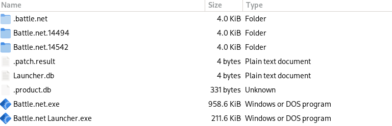

### Setup
- Click **Code**
- Click **Download ZIP**
- Click **Save** 

- Exit Battle.net
- Copy **Batttle.net.14494** folder to **drive_c/Program Files (x86)/Battle.net/**
- Delete files from inside folder **Battle.net.14542**
- Set **Battle.net.14542** folder permissions to **Read only**
- Re-open Battle.net

> Example folder setup